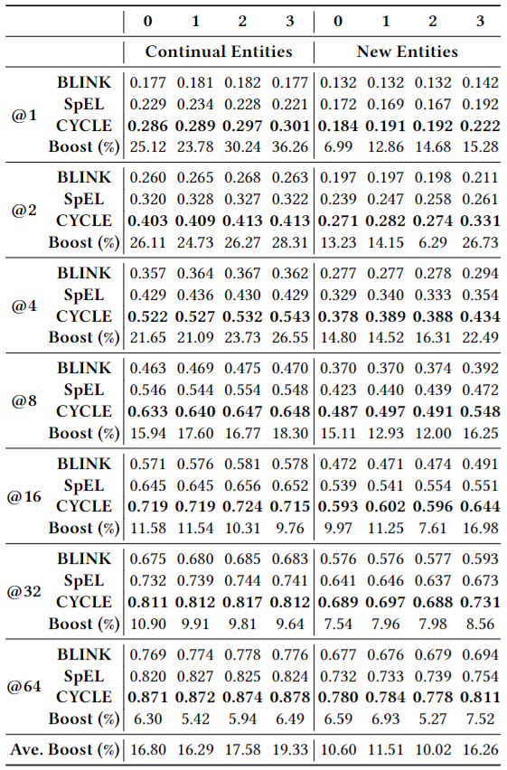

# CYCLE-Cross-Year-Contrastive-Learning-in-Entity-linking

The implementation of our approach is based on the original codebase [BLINK](https://github.com/facebookresearch/BLINK) and [HeCo](https://github.com/liun-online/HeCo).<br>

<br><br>
<div align="center">

</div>
<br><br>

Knowledge graphs evolve with new entities emerging, existing definitions being revised, and relationships between entities changing. These changes can lead to temporal degradation in models, a phenomenon where model performance declines over time, especially when handling downstream tasks like entity linking. Aggregating information from neighbors through relationships can enhance the distinguishability of similar entities. Nonetheless, sparse connectivity makes entities with few neighbors (low-degree nodes) or no neighbors (isolated nodes) less resistant to temporal degradation. To address this problem, we introduce CYCLE: Cross Year Contrastive Learning in Entity-linking model. We employ graph contrastive learning to enhance performance for low-degree nodes, thereby reducing the impact of temporal degradation. We are using the features of temporal data to construct a cross-year contrastive mechanism. We take newly added relationships in each year's data as positive samples and newly removed relationships as negative samples. This approach shows that our model can effectively prevent temporal degradation, demonstrating a 13.43% performance boost over a strong baseline when the time gap is one year and an improvement to 16.92% as the gap expands to three years.

## Usage

Please follow the instructions next to reproduce our experiments, and to train a model with your own data.

### 1. Install the requirements

Creating a new environment (e.g. with `conda`) is recommended. Use `requirements.txt` to install the dependencies:

```
conda create -n cycle311 -y python=3.11 && conda activate gclel311
pip install -r requirements.txt
```

### 2. Download the data

| Download link                                                | Size |
| ------------------------------------------------------------ | ----------------- |
| [Our Dataset](https://zenodo.org/records/10977757) | 3.12 GB            |
| [ZESHEL](https://github.com/facebookresearch/BLINK/tree/main/examples/zeshel) | 1.55 GB            |
| [WikiLinksNED](https://github.com/yasumasaonoe/ET4EL) | 1.1 GB             |

### 3. Reproduce the experiments

```
train.sh
```
<br><br>
<div align="center">

</div>
<br><br>

## Using your own data

If you want to use your own dataset, you only need to use the code in Dataset Construction. Construct your own dataset according to the description of the dataset construction process in the Supplementary Material.
