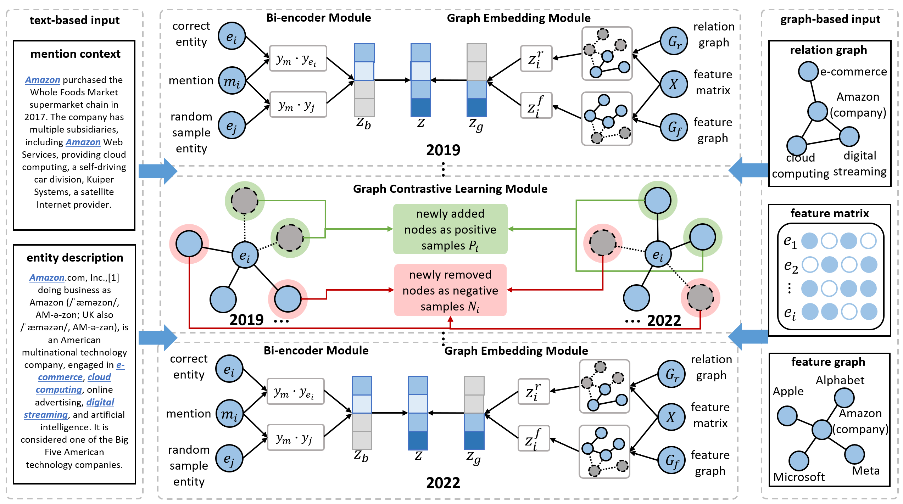

<div align="center">

# CYCLE: Cross-Year Contrastive Learning in Entity-Linking

<a href="https://doi.org/10.1145/3627673.3679702"></a>
<a href="https://pengyu-zhang.github.io/pdf/CYCLE.pdf"></a>
<a href="https://doi.org/10.5281/zenodo.12790219"></a>
<a href="https://doi.org/10.5281/zenodo.12794944"></a>
<a href="LICENSE"></a>



</div>

Knowledge graphs constantly evolve: entities emerge, definitions change and
relationships appear or disappear. These changes degrade entity-linking
models over time. CYCLE counteracts this temporal degradation with a
cross-year contrastive objective built from yearly knowledge-graph
snapshots. The paper, by Pengyu Zhang, Congfeng Cao, Klim Zaporojets and
Paul Groth, was published at the 33rd ACM International Conference on
Information and Knowledge Management (CIKM 2024).

## Overview

CYCLE pairs a BLINK-style bi-encoder with a graph module that learns
structurally enhanced entity representations from yearly knowledge-graph
snapshots: a relation graph (Wikidata5M edges per year), a feature graph
(k-nearest-neighbor links between entity descriptions) and a keyword
feature matrix. Newly added relationships act as positive samples and
removed ones as negative samples in a cross-year contrastive objective,
and the resulting graph embeddings enrich the candidate entity
representations used for linking.

## Repository structure

```text
├── assets/            # figures
├── configs/           # experiment configurations (baseline / paper / default)
├── data/              # dataset documentation; contents are downloaded, not tracked
├── scripts/           # setup, data, training and evaluation entry points
├── src/cycle/         # implementation (data, models, training, evaluation)
└── requirements.txt
```

## Installation

Python ≥ 3.10 with PyTorch ≥ 2.0 (any recent version works; tested with
Python 3.13 / PyTorch 2.13 / CUDA). A single 8 GB GPU is sufficient; CPU
also works, just slower. The scripts are bash (Linux/WSL/Git Bash).

```bash
CUDA_TAG=cu132 bash scripts/setup_env.sh   # pick the tag matching your CUDA; CUDA_TAG=cpu for CPU-only
```

## Data

The model trains and evaluates on **GCL-TempEL**, a temporal entity-linking
benchmark of ten yearly English Wikipedia snapshots (2013–2022, 10,373
entities per year) with two mention sets — *new entities* and *continual
entities* — derived from [TempEL](https://arxiv.org/abs/2302.02500) and
[Wikidata5M](https://deepgraphlearning.github.io/project/wikidata5m).

```bash
bash scripts/prepare_data.sh
```

This downloads GCL-TempEL (915 MB) from the official
[Zenodo record](https://doi.org/10.5281/zenodo.12794944), falls back to this
repository's [GitHub Release mirror](../../releases) if Zenodo is
unavailable, verifies the MD5 checksum, lays the files out under `data/raw/`
and precomputes the per-year graphs. See [data/README.md](data/README.md)
for the layout, sources and licensing.

## 🚀 Quick start

After installation and data preparation, one command checks the full
pipeline on a small slice (a few minutes):

```bash
bash scripts/smoke_test.sh
```

## Training and evaluation

Three configurations cover different needs:

| Config | Purpose |
| --- | --- |
| `configs/default.yaml` | Recommended configuration (best results): the paper's mechanism plus tuned training (larger batch, early stopping, full-pool negatives). |
| `configs/paper.yaml` | Faithful configuration of the published method (Eq. 1–15). |
| `configs/baseline.yaml` | Plain baseline without the paper's contributions, for controlled comparison. |

Train one model (config, entity set, train year, seed):

```bash
bash scripts/train.sh configs/default.yaml new 2019 52313
```

Evaluate it against the full entity pool of one or more test years
(recall@1…64 is appended to `eval_results.jsonl` in the run directory):

```bash
bash scripts/evaluate.sh outputs/new_2019_default_seed52313 2019,2020,2021,2022
```

Other entry points:

```bash
bash scripts/run_all.sh       # the full experiment grid (resumable, fail-fast)
python -m cycle.report        # aggregate eval results into per-gap tables
```

Runs are fully seeded; the device in use is printed at startup; training
metrics stream to `outputs/<run>/metrics.jsonl` incrementally, so nothing is
lost on interruption.

## 📊 Results

Quantitative results are reported in the paper and its
[supplementary material](https://doi.org/10.5281/zenodo.12790219).

## 📝 Citation

```bibtex
@inproceedings{zhang2024cycle,
  author    = {Zhang, Pengyu and Cao, Congfeng and Zaporojets, Klim and Groth, Paul},
  title     = {{CYCLE}: Cross-Year Contrastive Learning in Entity-Linking},
  booktitle = {Proceedings of the 33rd ACM International Conference on
               Information and Knowledge Management (CIKM '24)},
  year      = {2024},
  pages     = {3197--3206},
  doi       = {10.1145/3627673.3679702}
}
```

## 🙏 Acknowledgments & License

This implementation builds on
[BLINK](https://github.com/facebookresearch/BLINK) (bi-encoder entity
linking) and [HeCo](https://github.com/liun-online/HeCo) (heterogeneous
graph contrastive learning). The GCL-TempEL benchmark derives from
[TempEL](https://arxiv.org/abs/2302.02500) and
[Wikidata5M](https://deepgraphlearning.github.io/project/wikidata5m).

This repository is released under the [MIT License](LICENSE).

---

Maintained by [Pengyu Zhang](https://pengyu-zhang.github.io/).
