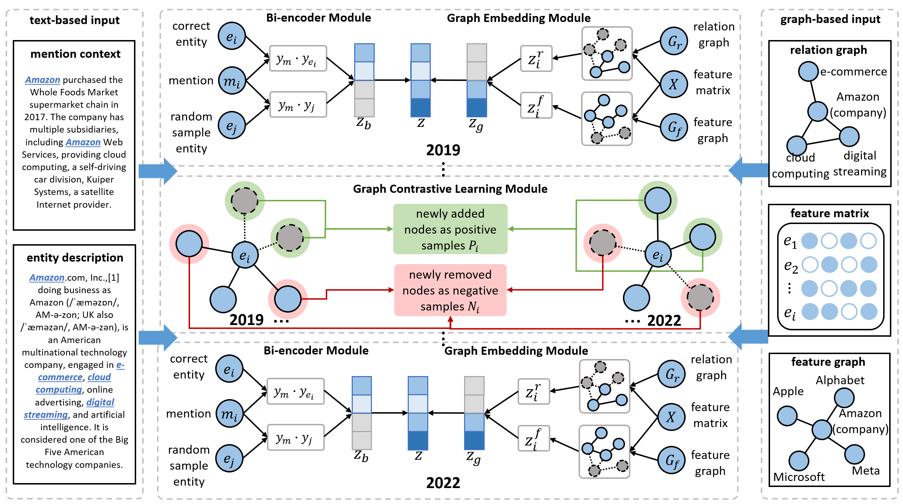

# CYCLE-Cross-Year-Contrastive-Learning-in-Entity-linking

The implementation of our approach is based on the original codebase [BLINK](https://github.com/facebookresearch/BLINK) and [HeCo](https://github.com/liun-online/HeCo).<br>

<br><br>
<div align="center">

</div>
<br><br>

Knowledge graphs evolve with new entities emerging, existing definitions being revised, and relationships between entities changing. These changes can lead to temporal degradation in models, a phenomenon where model performance declines over time, especially when handling downstream tasks like entity linking. Aggregating information from neighbors through relationships can enhance the distinguishability of similar entities. Nonetheless, sparse connectivity makes entities with few neighbors (low-degree nodes) or no neighbors (isolated nodes) less resistant to temporal degradation. To address this problem, we introduce CYCLE: Cross Year Contrastive Learning in Entity-linking model. We employ graph contrastive learning to enhance performance for low-degree nodes, thereby reducing the impact of temporal degradation. We are using the features of temporal data to construct a cross-year contrastive mechanism. We take newly added relationships in each year's data as positive samples and newly removed relationships as negative samples. This approach shows that our model can effectively prevent temporal degradation, demonstrating a 13.43% performance boost over a strong baseline when the time gap is one year and an improvement to 16.92% as the gap expands to three years.

## Usage

Please follow the instructions next to reproduce our experiments, and to train a model with your own data.

### 1. Install the requirements

Creating a new environment (e.g. with `conda`) is recommended. Use `requirements.txt` to install the dependencies:

```
conda create -n cycle311 -y python=3.11 && conda activate gclel311
pip install -r requirements.txt
```

### 2. Download the data

| Download link                                                | Size |
| ------------------------------------------------------------ | ----------------- |
| [Our Dataset](https://zenodo.org/records/10977757) | 3.12 GB            |
| [ZESHEL](https://github.com/facebookresearch/BLINK/tree/main/examples/zeshel) | 1.55 GB            |
| [WikiLinksNED](https://github.com/yasumasaonoe/ET4EL) | 1.1 GB             |

### 3. Reproduce the experiments

```
train.sh
```

<table class="tg">
<thead>
  <tr>
    <th class="tg-c3ow" colspan="12">Only Forward</th>
  </tr>
</thead>
<tbody>
  <tr>
    <td class="tg-c3ow"></td>
    <td class="tg-c3ow"></td>
    <td class="tg-c3ow">0</td>
    <td class="tg-c3ow">1</td>
    <td class="tg-c3ow">2</td>
    <td class="tg-c3ow">3</td>
    <td class="tg-c3ow">4</td>
    <td class="tg-c3ow">5</td>
    <td class="tg-c3ow">6</td>
    <td class="tg-c3ow">7</td>
    <td class="tg-c3ow">8</td>
    <td class="tg-c3ow">9</td>
  </tr>
  <tr>
    <td class="tg-c3ow" rowspan="3">@1</td>
    <td class="tg-c3ow">BLINK</td>
    <td class="tg-c3ow">0.1333</td>
    <td class="tg-c3ow">0.1339</td>
    <td class="tg-c3ow">0.1339</td>
    <td class="tg-c3ow">0.1356</td>
    <td class="tg-c3ow">0.1350</td>
    <td class="tg-c3ow">0.1361</td>
    <td class="tg-c3ow">0.1349</td>
    <td class="tg-c3ow">0.1358</td>
    <td class="tg-c3ow">0.1346</td>
    <td class="tg-c3ow">0.1430</td>
  </tr>
  <tr>
    <td class="tg-c3ow">CYCLE</td>
    <td class="tg-c3ow">0.1380</td>
    <td class="tg-c3ow">0.1397</td>
    <td class="tg-c3ow">0.1401</td>
    <td class="tg-c3ow">0.1413</td>
    <td class="tg-c3ow">0.1417</td>
    <td class="tg-c3ow">0.1443</td>
    <td class="tg-c3ow">0.1445</td>
    <td class="tg-c3ow">0.1477</td>
    <td class="tg-c3ow">0.1558</td>
    <td class="tg-c3ow">0.1737</td>
  </tr>
  <tr>
    <td class="tg-c3ow">Boost</td>
    <td class="tg-c3ow">3.50%</td>
    <td class="tg-c3ow">4.30%</td>
    <td class="tg-c3ow">4.64%</td>
    <td class="tg-c3ow">4.20%</td>
    <td class="tg-c3ow">4.99%</td>
    <td class="tg-c3ow">6.04%</td>
    <td class="tg-c3ow">7.14%</td>
    <td class="tg-c3ow">8.79%</td>
    <td class="tg-c3ow">15.79%</td>
    <td class="tg-c3ow">21.47%</td>
  </tr>
  <tr>
    <td class="tg-c3ow" rowspan="3">@2</td>
    <td class="tg-c3ow">BLINK</td>
    <td class="tg-c3ow">0.1995</td>
    <td class="tg-c3ow">0.1999</td>
    <td class="tg-c3ow">0.2004</td>
    <td class="tg-c3ow">0.2022</td>
    <td class="tg-c3ow">0.2015</td>
    <td class="tg-c3ow">0.2028</td>
    <td class="tg-c3ow">0.2010</td>
    <td class="tg-c3ow">0.2016</td>
    <td class="tg-c3ow">0.1999</td>
    <td class="tg-c3ow">0.2115</td>
  </tr>
  <tr>
    <td class="tg-c3ow">CYCLE</td>
    <td class="tg-c3ow">0.2055</td>
    <td class="tg-c3ow">0.2076</td>
    <td class="tg-c3ow">0.2084</td>
    <td class="tg-c3ow">0.2093</td>
    <td class="tg-c3ow">0.2099</td>
    <td class="tg-c3ow">0.2136</td>
    <td class="tg-c3ow">0.2138</td>
    <td class="tg-c3ow">0.2164</td>
    <td class="tg-c3ow">0.2276</td>
    <td class="tg-c3ow">0.2530</td>
  </tr>
  <tr>
    <td class="tg-c3ow">Boost</td>
    <td class="tg-c3ow">3.03%</td>
    <td class="tg-c3ow">3.82%</td>
    <td class="tg-c3ow">4.01%</td>
    <td class="tg-c3ow">3.48%</td>
    <td class="tg-c3ow">4.17%</td>
    <td class="tg-c3ow">5.37%</td>
    <td class="tg-c3ow">6.36%</td>
    <td class="tg-c3ow">7.34%</td>
    <td class="tg-c3ow">13.86%</td>
    <td class="tg-c3ow">19.62%</td>
  </tr>
  <tr>
    <td class="tg-c3ow" rowspan="3">@4</td>
    <td class="tg-c3ow">BLINK</td>
    <td class="tg-c3ow">0.2795</td>
    <td class="tg-c3ow">0.2789</td>
    <td class="tg-c3ow">0.2804</td>
    <td class="tg-c3ow">0.2825</td>
    <td class="tg-c3ow">0.2810</td>
    <td class="tg-c3ow">0.2837</td>
    <td class="tg-c3ow">0.2803</td>
    <td class="tg-c3ow">0.2813</td>
    <td class="tg-c3ow">0.2786</td>
    <td class="tg-c3ow">0.2951</td>
  </tr>
  <tr>
    <td class="tg-c3ow">CYCLE</td>
    <td class="tg-c3ow">0.2867</td>
    <td class="tg-c3ow">0.2890</td>
    <td class="tg-c3ow">0.2901</td>
    <td class="tg-c3ow">0.2919</td>
    <td class="tg-c3ow">0.2914</td>
    <td class="tg-c3ow">0.2949</td>
    <td class="tg-c3ow">0.2948</td>
    <td class="tg-c3ow">0.2984</td>
    <td class="tg-c3ow">0.3106</td>
    <td class="tg-c3ow">0.3451</td>
  </tr>
  <tr>
    <td class="tg-c3ow">Boost</td>
    <td class="tg-c3ow">2.59%</td>
    <td class="tg-c3ow">3.63%</td>
    <td class="tg-c3ow">3.43%</td>
    <td class="tg-c3ow">3.34%</td>
    <td class="tg-c3ow">3.68%</td>
    <td class="tg-c3ow">3.94%</td>
    <td class="tg-c3ow">5.17%</td>
    <td class="tg-c3ow">6.07%</td>
    <td class="tg-c3ow">11.49%</td>
    <td class="tg-c3ow">16.94%</td>
  </tr>
  <tr>
    <td class="tg-c3ow" rowspan="3">@8</td>
    <td class="tg-c3ow">BLINK</td>
    <td class="tg-c3ow">0.3721</td>
    <td class="tg-c3ow">0.3717</td>
    <td class="tg-c3ow">0.3735</td>
    <td class="tg-c3ow">0.3753</td>
    <td class="tg-c3ow">0.3725</td>
    <td class="tg-c3ow">0.3745</td>
    <td class="tg-c3ow">0.3714</td>
    <td class="tg-c3ow">0.3712</td>
    <td class="tg-c3ow">0.3684</td>
    <td class="tg-c3ow">0.3881</td>
  </tr>
  <tr>
    <td class="tg-c3ow">CYCLE</td>
    <td class="tg-c3ow">0.3797</td>
    <td class="tg-c3ow">0.3822</td>
    <td class="tg-c3ow">0.3831</td>
    <td class="tg-c3ow">0.3849</td>
    <td class="tg-c3ow">0.3836</td>
    <td class="tg-c3ow">0.3895</td>
    <td class="tg-c3ow">0.3877</td>
    <td class="tg-c3ow">0.3900</td>
    <td class="tg-c3ow">0.4031</td>
    <td class="tg-c3ow">0.4400</td>
  </tr>
  <tr>
    <td class="tg-c3ow">Boost</td>
    <td class="tg-c3ow">2.06%</td>
    <td class="tg-c3ow">2.82%</td>
    <td class="tg-c3ow">2.56%</td>
    <td class="tg-c3ow">2.57%</td>
    <td class="tg-c3ow">2.98%</td>
    <td class="tg-c3ow">4.01%</td>
    <td class="tg-c3ow">4.38%</td>
    <td class="tg-c3ow">5.06%</td>
    <td class="tg-c3ow">9.41%</td>
    <td class="tg-c3ow">13.37%</td>
  </tr>
  <tr>
    <td class="tg-c3ow" rowspan="3">@16</td>
    <td class="tg-c3ow">BLINK</td>
    <td class="tg-c3ow">0.4718</td>
    <td class="tg-c3ow">0.4717</td>
    <td class="tg-c3ow">0.4725</td>
    <td class="tg-c3ow">0.4738</td>
    <td class="tg-c3ow">0.4707</td>
    <td class="tg-c3ow">0.4729</td>
    <td class="tg-c3ow">0.4693</td>
    <td class="tg-c3ow">0.4680</td>
    <td class="tg-c3ow">0.4663</td>
    <td class="tg-c3ow">0.4850</td>
  </tr>
  <tr>
    <td class="tg-c3ow">CYCLE</td>
    <td class="tg-c3ow">0.4796</td>
    <td class="tg-c3ow">0.4823</td>
    <td class="tg-c3ow">0.4825</td>
    <td class="tg-c3ow">0.4833</td>
    <td class="tg-c3ow">0.4824</td>
    <td class="tg-c3ow">0.4873</td>
    <td class="tg-c3ow">0.4860</td>
    <td class="tg-c3ow">0.4864</td>
    <td class="tg-c3ow">0.5004</td>
    <td class="tg-c3ow">0.5377</td>
  </tr>
  <tr>
    <td class="tg-c3ow">Boost</td>
    <td class="tg-c3ow">1.66%</td>
    <td class="tg-c3ow">2.25%</td>
    <td class="tg-c3ow">2.12%</td>
    <td class="tg-c3ow">2.02%</td>
    <td class="tg-c3ow">2.47%</td>
    <td class="tg-c3ow">3.04%</td>
    <td class="tg-c3ow">3.56%</td>
    <td class="tg-c3ow">3.92%</td>
    <td class="tg-c3ow">7.31%</td>
    <td class="tg-c3ow">10.87%</td>
  </tr>
  <tr>
    <td class="tg-c3ow" rowspan="3">@32</td>
    <td class="tg-c3ow">BLINK</td>
    <td class="tg-c3ow">0.5749</td>
    <td class="tg-c3ow">0.5746</td>
    <td class="tg-c3ow">0.5742</td>
    <td class="tg-c3ow">0.5751</td>
    <td class="tg-c3ow">0.5716</td>
    <td class="tg-c3ow">0.5738</td>
    <td class="tg-c3ow">0.5695</td>
    <td class="tg-c3ow">0.5679</td>
    <td class="tg-c3ow">0.5655</td>
    <td class="tg-c3ow">0.5854</td>
  </tr>
  <tr>
    <td class="tg-c3ow">CYCLE</td>
    <td class="tg-c3ow">0.5826</td>
    <td class="tg-c3ow">0.5845</td>
    <td class="tg-c3ow">0.5845</td>
    <td class="tg-c3ow">0.5848</td>
    <td class="tg-c3ow">0.5835</td>
    <td class="tg-c3ow">0.5875</td>
    <td class="tg-c3ow">0.5854</td>
    <td class="tg-c3ow">0.5855</td>
    <td class="tg-c3ow">0.5976</td>
    <td class="tg-c3ow">0.6326</td>
  </tr>
  <tr>
    <td class="tg-c3ow">Boost</td>
    <td class="tg-c3ow">1.34%</td>
    <td class="tg-c3ow">1.73%</td>
    <td class="tg-c3ow">1.79%</td>
    <td class="tg-c3ow">1.69%</td>
    <td class="tg-c3ow">2.08%</td>
    <td class="tg-c3ow">2.40%</td>
    <td class="tg-c3ow">2.78%</td>
    <td class="tg-c3ow">3.09%</td>
    <td class="tg-c3ow">5.68%</td>
    <td class="tg-c3ow">8.06%</td>
  </tr>
  <tr>
    <td class="tg-c3ow" rowspan="3">@64</td>
    <td class="tg-c3ow">BLINK</td>
    <td class="tg-c3ow">0.6742</td>
    <td class="tg-c3ow">0.6739</td>
    <td class="tg-c3ow">0.6735</td>
    <td class="tg-c3ow">0.6743</td>
    <td class="tg-c3ow">0.6712</td>
    <td class="tg-c3ow">0.6734</td>
    <td class="tg-c3ow">0.6698</td>
    <td class="tg-c3ow">0.6671</td>
    <td class="tg-c3ow">0.6652</td>
    <td class="tg-c3ow">0.6833</td>
  </tr>
  <tr>
    <td class="tg-c3ow">CYCLE</td>
    <td class="tg-c3ow">0.6817</td>
    <td class="tg-c3ow">0.6828</td>
    <td class="tg-c3ow">0.6824</td>
    <td class="tg-c3ow">0.6827</td>
    <td class="tg-c3ow">0.6820</td>
    <td class="tg-c3ow">0.6858</td>
    <td class="tg-c3ow">0.6821</td>
    <td class="tg-c3ow">0.6802</td>
    <td class="tg-c3ow">0.6911</td>
    <td class="tg-c3ow">0.7224</td>
  </tr>
  <tr>
    <td class="tg-c3ow">Boost</td>
    <td class="tg-c3ow">1.11%</td>
    <td class="tg-c3ow">1.32%</td>
    <td class="tg-c3ow">1.33%</td>
    <td class="tg-c3ow">1.24%</td>
    <td class="tg-c3ow">1.60%</td>
    <td class="tg-c3ow">1.84%</td>
    <td class="tg-c3ow">1.84%</td>
    <td class="tg-c3ow">1.97%</td>
    <td class="tg-c3ow">3.89%</td>
    <td class="tg-c3ow">5.72%</td>
  </tr>
  <tr>
    <th class="tg-c3ow" colspan="12">Forward and Backward</td>
  </tr>
  <tr>
    <td class="tg-c3ow" rowspan="3">@1</td>
    <td class="tg-c3ow">BLINK</td>
    <td class="tg-c3ow">0.1333</td>
    <td class="tg-c3ow">0.1326</td>
    <td class="tg-c3ow">0.1331</td>
    <td class="tg-c3ow">0.1333</td>
    <td class="tg-c3ow">0.1330</td>
    <td class="tg-c3ow">0.1326</td>
    <td class="tg-c3ow">0.1322</td>
    <td class="tg-c3ow">0.1306</td>
    <td class="tg-c3ow">0.1306</td>
    <td class="tg-c3ow">0.1349</td>
  </tr>
  <tr>
    <td class="tg-c3ow">CYCLE</td>
    <td class="tg-c3ow">0.1380</td>
    <td class="tg-c3ow">0.1368</td>
    <td class="tg-c3ow">0.1370</td>
    <td class="tg-c3ow">0.1375</td>
    <td class="tg-c3ow">0.1377</td>
    <td class="tg-c3ow">0.1382</td>
    <td class="tg-c3ow">0.1384</td>
    <td class="tg-c3ow">0.1389</td>
    <td class="tg-c3ow">0.1421</td>
    <td class="tg-c3ow">0.1489</td>
  </tr>
  <tr>
    <td class="tg-c3ow">Boost</td>
    <td class="tg-c3ow">3.50%</td>
    <td class="tg-c3ow">3.14%</td>
    <td class="tg-c3ow">2.94%</td>
    <td class="tg-c3ow">3.16%</td>
    <td class="tg-c3ow">3.50%</td>
    <td class="tg-c3ow">4.27%</td>
    <td class="tg-c3ow">4.72%</td>
    <td class="tg-c3ow">6.34%</td>
    <td class="tg-c3ow">8.83%</td>
    <td class="tg-c3ow">10.42%</td>
  </tr>
  <tr>
    <td class="tg-c3ow" rowspan="3">@2</td>
    <td class="tg-c3ow">BLINK</td>
    <td class="tg-c3ow">0.1995</td>
    <td class="tg-c3ow">0.1985</td>
    <td class="tg-c3ow">0.1993</td>
    <td class="tg-c3ow">0.1997</td>
    <td class="tg-c3ow">0.1991</td>
    <td class="tg-c3ow">0.1983</td>
    <td class="tg-c3ow">0.1973</td>
    <td class="tg-c3ow">0.1958</td>
    <td class="tg-c3ow">0.1956</td>
    <td class="tg-c3ow">0.2014</td>
  </tr>
  <tr>
    <td class="tg-c3ow">CYCLE</td>
    <td class="tg-c3ow">0.2055</td>
    <td class="tg-c3ow">0.2037</td>
    <td class="tg-c3ow">0.2042</td>
    <td class="tg-c3ow">0.2049</td>
    <td class="tg-c3ow">0.2049</td>
    <td class="tg-c3ow">0.2058</td>
    <td class="tg-c3ow">0.2061</td>
    <td class="tg-c3ow">0.2063</td>
    <td class="tg-c3ow">0.2105</td>
    <td class="tg-c3ow">0.2196</td>
  </tr>
  <tr>
    <td class="tg-c3ow">Boost</td>
    <td class="tg-c3ow">3.03%</td>
    <td class="tg-c3ow">2.62%</td>
    <td class="tg-c3ow">2.50%</td>
    <td class="tg-c3ow">2.58%</td>
    <td class="tg-c3ow">2.93%</td>
    <td class="tg-c3ow">3.80%</td>
    <td class="tg-c3ow">4.45%</td>
    <td class="tg-c3ow">5.35%</td>
    <td class="tg-c3ow">7.63%</td>
    <td class="tg-c3ow">9.01%</td>
  </tr>
  <tr>
    <td class="tg-c3ow" rowspan="3">@4</td>
    <td class="tg-c3ow">BLINK</td>
    <td class="tg-c3ow">0.2795</td>
    <td class="tg-c3ow">0.2777</td>
    <td class="tg-c3ow">0.2794</td>
    <td class="tg-c3ow">0.2797</td>
    <td class="tg-c3ow">0.2788</td>
    <td class="tg-c3ow">0.2787</td>
    <td class="tg-c3ow">0.2771</td>
    <td class="tg-c3ow">0.2749</td>
    <td class="tg-c3ow">0.2743</td>
    <td class="tg-c3ow">0.2829</td>
  </tr>
  <tr>
    <td class="tg-c3ow">CYCLE</td>
    <td class="tg-c3ow">0.2867</td>
    <td class="tg-c3ow">0.2845</td>
    <td class="tg-c3ow">0.2849</td>
    <td class="tg-c3ow">0.2865</td>
    <td class="tg-c3ow">0.2860</td>
    <td class="tg-c3ow">0.2864</td>
    <td class="tg-c3ow">0.2870</td>
    <td class="tg-c3ow">0.2866</td>
    <td class="tg-c3ow">0.2914</td>
    <td class="tg-c3ow">0.3039</td>
  </tr>
  <tr>
    <td class="tg-c3ow">Boost</td>
    <td class="tg-c3ow">2.59%</td>
    <td class="tg-c3ow">2.46%</td>
    <td class="tg-c3ow">1.98%</td>
    <td class="tg-c3ow">2.45%</td>
    <td class="tg-c3ow">2.59%</td>
    <td class="tg-c3ow">2.79%</td>
    <td class="tg-c3ow">3.56%</td>
    <td class="tg-c3ow">4.25%</td>
    <td class="tg-c3ow">6.25%</td>
    <td class="tg-c3ow">7.41%</td>
  </tr>
  <tr>
    <td class="tg-c3ow" rowspan="3">@8</td>
    <td class="tg-c3ow">BLINK</td>
    <td class="tg-c3ow">0.3721</td>
    <td class="tg-c3ow">0.3704</td>
    <td class="tg-c3ow">0.3721</td>
    <td class="tg-c3ow">0.3732</td>
    <td class="tg-c3ow">0.3714</td>
    <td class="tg-c3ow">0.3708</td>
    <td class="tg-c3ow">0.3692</td>
    <td class="tg-c3ow">0.3653</td>
    <td class="tg-c3ow">0.3651</td>
    <td class="tg-c3ow">0.3749</td>
  </tr>
  <tr>
    <td class="tg-c3ow">CYCLE</td>
    <td class="tg-c3ow">0.3797</td>
    <td class="tg-c3ow">0.3774</td>
    <td class="tg-c3ow">0.3780</td>
    <td class="tg-c3ow">0.3796</td>
    <td class="tg-c3ow">0.3788</td>
    <td class="tg-c3ow">0.3802</td>
    <td class="tg-c3ow">0.3802</td>
    <td class="tg-c3ow">0.3788</td>
    <td class="tg-c3ow">0.3837</td>
    <td class="tg-c3ow">0.3958</td>
  </tr>
  <tr>
    <td class="tg-c3ow">Boost</td>
    <td class="tg-c3ow">2.06%</td>
    <td class="tg-c3ow">1.87%</td>
    <td class="tg-c3ow">1.57%</td>
    <td class="tg-c3ow">1.72%</td>
    <td class="tg-c3ow">2.00%</td>
    <td class="tg-c3ow">2.52%</td>
    <td class="tg-c3ow">2.97%</td>
    <td class="tg-c3ow">3.70%</td>
    <td class="tg-c3ow">5.07%</td>
    <td class="tg-c3ow">5.59%</td>
  </tr>
  <tr>
    <td class="tg-c3ow" rowspan="3">@16</td>
    <td class="tg-c3ow">BLINK</td>
    <td class="tg-c3ow">0.4718</td>
    <td class="tg-c3ow">0.4703</td>
    <td class="tg-c3ow">0.4721</td>
    <td class="tg-c3ow">0.4727</td>
    <td class="tg-c3ow">0.4710</td>
    <td class="tg-c3ow">0.4703</td>
    <td class="tg-c3ow">0.4689</td>
    <td class="tg-c3ow">0.4643</td>
    <td class="tg-c3ow">0.4645</td>
    <td class="tg-c3ow">0.4726</td>
  </tr>
  <tr>
    <td class="tg-c3ow">CYCLE</td>
    <td class="tg-c3ow">0.4796</td>
    <td class="tg-c3ow">0.4776</td>
    <td class="tg-c3ow">0.4782</td>
    <td class="tg-c3ow">0.4795</td>
    <td class="tg-c3ow">0.4784</td>
    <td class="tg-c3ow">0.4797</td>
    <td class="tg-c3ow">0.4801</td>
    <td class="tg-c3ow">0.4773</td>
    <td class="tg-c3ow">0.4823</td>
    <td class="tg-c3ow">0.4937</td>
  </tr>
  <tr>
    <td class="tg-c3ow">Boost</td>
    <td class="tg-c3ow">1.66%</td>
    <td class="tg-c3ow">1.56%</td>
    <td class="tg-c3ow">1.29%</td>
    <td class="tg-c3ow">1.45%</td>
    <td class="tg-c3ow">1.58%</td>
    <td class="tg-c3ow">1.99%</td>
    <td class="tg-c3ow">2.39%</td>
    <td class="tg-c3ow">2.81%</td>
    <td class="tg-c3ow">3.83%</td>
    <td class="tg-c3ow">4.47%</td>
  </tr>
  <tr>
    <td class="tg-c3ow" rowspan="3">@32</td>
    <td class="tg-c3ow">BLINK</td>
    <td class="tg-c3ow">0.5749</td>
    <td class="tg-c3ow">0.5731</td>
    <td class="tg-c3ow">0.5745</td>
    <td class="tg-c3ow">0.5748</td>
    <td class="tg-c3ow">0.5729</td>
    <td class="tg-c3ow">0.5724</td>
    <td class="tg-c3ow">0.5711</td>
    <td class="tg-c3ow">0.5660</td>
    <td class="tg-c3ow">0.5659</td>
    <td class="tg-c3ow">0.5745</td>
  </tr>
  <tr>
    <td class="tg-c3ow">CYCLE</td>
    <td class="tg-c3ow">0.5826</td>
    <td class="tg-c3ow">0.5803</td>
    <td class="tg-c3ow">0.5810</td>
    <td class="tg-c3ow">0.5822</td>
    <td class="tg-c3ow">0.5809</td>
    <td class="tg-c3ow">0.5807</td>
    <td class="tg-c3ow">0.5819</td>
    <td class="tg-c3ow">0.5788</td>
    <td class="tg-c3ow">0.5825</td>
    <td class="tg-c3ow">0.5933</td>
  </tr>
  <tr>
    <td class="tg-c3ow">Boost</td>
    <td class="tg-c3ow">1.34%</td>
    <td class="tg-c3ow">1.25%</td>
    <td class="tg-c3ow">1.13%</td>
    <td class="tg-c3ow">1.28%</td>
    <td class="tg-c3ow">1.40%</td>
    <td class="tg-c3ow">1.46%</td>
    <td class="tg-c3ow">1.90%</td>
    <td class="tg-c3ow">2.26%</td>
    <td class="tg-c3ow">2.94%</td>
    <td class="tg-c3ow">3.27%</td>
  </tr>
  <tr>
    <td class="tg-c3ow" rowspan="3">@64</td>
    <td class="tg-c3ow">BLINK</td>
    <td class="tg-c3ow">0.6742</td>
    <td class="tg-c3ow">0.6731</td>
    <td class="tg-c3ow">0.6741</td>
    <td class="tg-c3ow">0.6749</td>
    <td class="tg-c3ow">0.6733</td>
    <td class="tg-c3ow">0.6730</td>
    <td class="tg-c3ow">0.6723</td>
    <td class="tg-c3ow">0.6675</td>
    <td class="tg-c3ow">0.6665</td>
    <td class="tg-c3ow">0.6737</td>
  </tr>
  <tr>
    <td class="tg-c3ow">CYCLE</td>
    <td class="tg-c3ow">0.6817</td>
    <td class="tg-c3ow">0.6795</td>
    <td class="tg-c3ow">0.6800</td>
    <td class="tg-c3ow">0.6813</td>
    <td class="tg-c3ow">0.6807</td>
    <td class="tg-c3ow">0.6805</td>
    <td class="tg-c3ow">0.6803</td>
    <td class="tg-c3ow">0.6769</td>
    <td class="tg-c3ow">0.6807</td>
    <td class="tg-c3ow">0.6906</td>
  </tr>
  <tr>
    <td class="tg-c3ow">Boost</td>
    <td class="tg-c3ow">1.11%</td>
    <td class="tg-c3ow">0.95%</td>
    <td class="tg-c3ow">0.87%</td>
    <td class="tg-c3ow">0.95%</td>
    <td class="tg-c3ow">1.11%</td>
    <td class="tg-c3ow">1.12%</td>
    <td class="tg-c3ow">1.19%</td>
    <td class="tg-c3ow">1.42%</td>
    <td class="tg-c3ow">2.13%</td>
    <td class="tg-c3ow">2.52%</td>
  </tr>
</tbody>
</table>

## Using your own data

If you want to use your own dataset, you only need to use the code in Dataset Construction. Construct your own dataset according to the description of the dataset construction process in the Supplementary Material.
